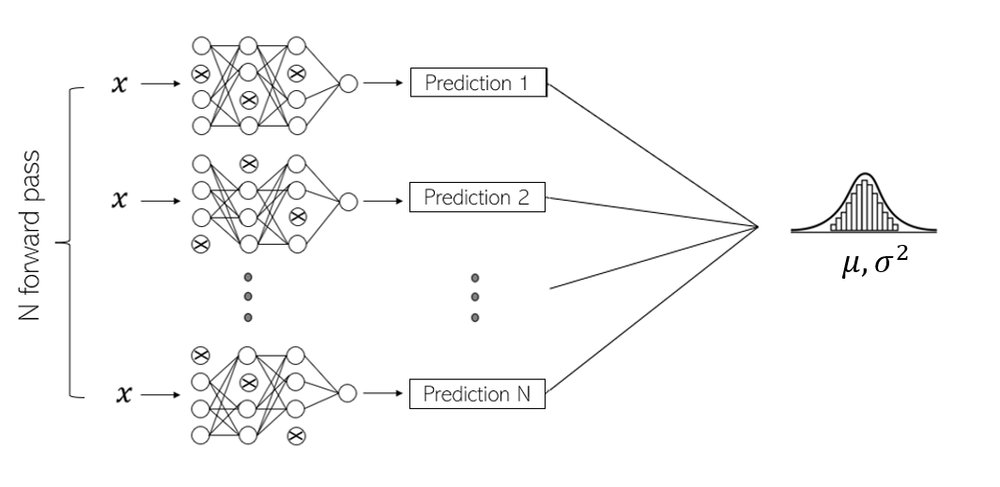

  <h1> Monte Carl dropout </h1>

MonteCarlo Dropout for Uncertainty Quantification
In this repository, we will use Monte Carlo Dropout as a method for quantifying uncertainty. Yarin et al presented in the paper below a method to bypasse the inference in Bayesian framework by using Monte Carlo technique to approximate the posterior distribution. 
Unlike the classical Dropout used in Deep Neural Networks, where we deactivate some neurones in each layer by defining a dropout rate (a probability)

References : 
> Yarin Gal and Zoubin Ghahramani. Dropout as a bayesian approximation : Representing model
uncertainty in deep learning. In international conference on machine learning, pages 1050–1059.
PMLR, 2016.
