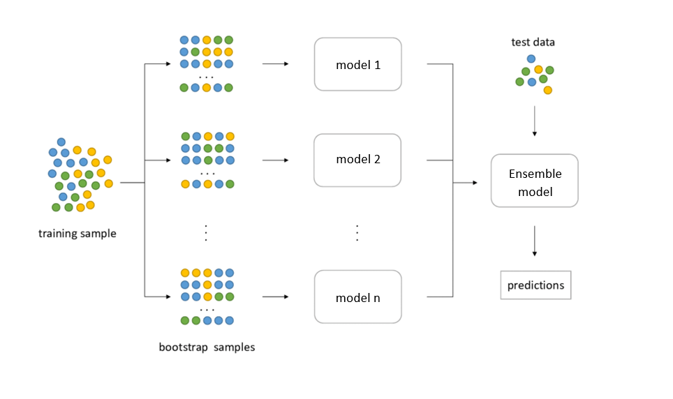
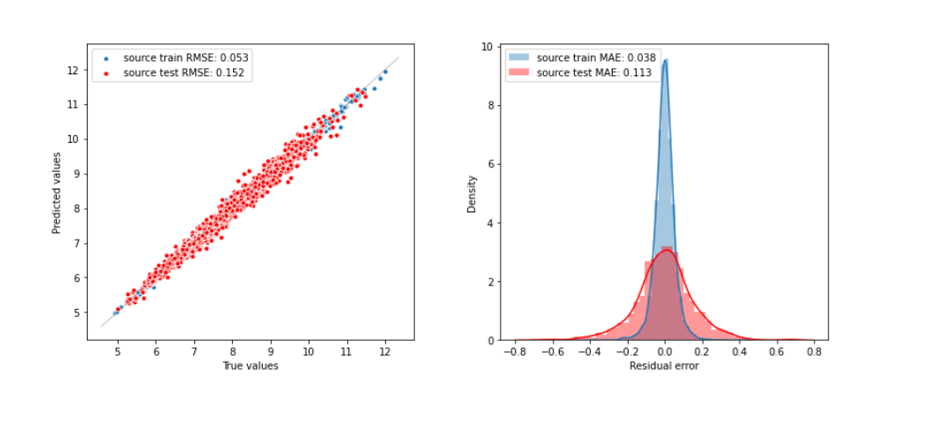
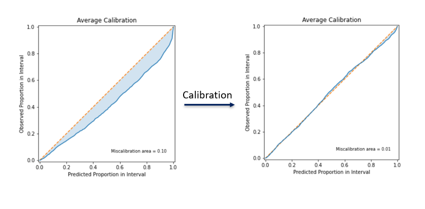
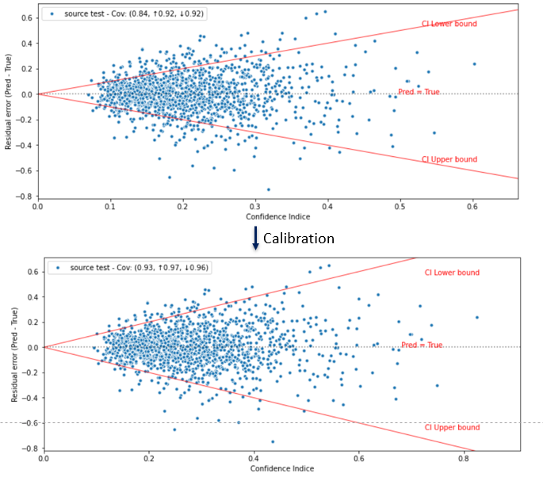

    <h2> Bagging with Neural Networks </h2>

 

## 1. Presentation
Following the same intuition of the Random Forest Regressor, the idea was to use multiple decision trees trained on different samples to get different predictions. The Bagging or Bootstrap Aggregation ( Bagging = **B**ootstrap + **agg**regat**ing** ) using Neural Network is using multiple Neural Nets with the Bootstrap step to get different predictions.

Two factors cause the variability of the results: the bootstrapping technique that creates the stochasticity in the training process and the diversity of models.

The main drawback of this method is the cost of saving multiple models. It can be costly in terms of memory.

    

The results of this method is very statisfying and do well in both tasks, predicition and uncertainty quantification, but the big drawback is the memory cost of saving multiple models.

## 2. Results
To asses the prediciton task ( regression ), we compute the Mean Absolute Error and the Root Mean Squared  Error, and hense we find that the quality of prediction is vey good.

    <h4> MAE = 0.152 &nbsp RMSE = 0.113 </h4> 

As an interpretation of these results,  the model gives a good prediction close to the groud truth.

    

To assess the uncertainty we can look at other metrics, namely the negative loglikelihood, the coverage and sharpness. 

| Neglog      | Calibration Error | Sharpness |
| :-----------: | :-----------: | :-----------: |
| -0.344      | 0.087       |  0.113 |

Notice that we have a negative Neglog, which represents a positive evaluation of the overall method (prediction and uncertainty quantification). The results are coherent as we can see, a low value in sharpness and a very small Calibration Error.

Let's check the calibration curve before and after calibration, the results of the first curve will give us an insight on how much the result are accurate by default.

    

Notice that before the calibration, the model was a little over confident about the results, the miscalibrated area is small ( shaded area). 
After the calibration step, we end up by having a perfect line that overlay the diagonal.

In the next figure, we plot residual error over the confidence level, this plot gives an insight on the correlation between the error made by the model and the uncertainty. 

    

Notice that after calibration, the coverage inside the confidence interval reaches 93%. 
## 3. References

Breiman, Leo. "Bagging predictors." Machine learning 24.2 (1996): 123-140.