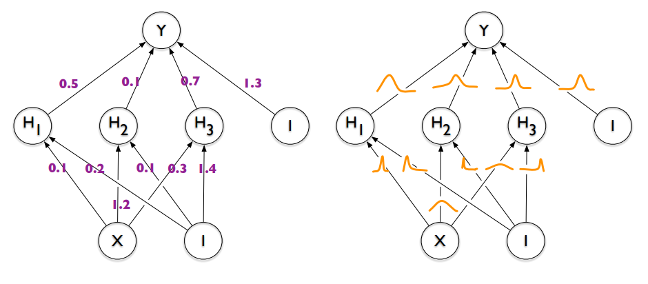

<h2 align = 'center'> Bayes By Backprop </h2>

### Introduction
Bayesian Neural Networks are the most used method to quantify uncertainty, unlike the classical setup where we want the model to learn the parameters and expecting a scalare values, in the Bayesian setup we put distributions over the parameters and learn the paramaters of that distribution. using the Bayes rule hense the name Bayesian. 

        

The quantity that we want is the posterior, and try to learn this probibility distribution using Bayes rule using a prior and and a Likelihood. 

   

 

Considering the following notations, where  is the training data, and  are the model parameters, we have the Bayes formula : 

 

Since the marginal likelihood ( the evidence) is untractable, the posterior cannot be analyticaly computed and hence the trick of approximating the posterior : this is what we call **Variational Inference** where we choose a variational posterior , and try to get close as possible to the true posterior  by minimizing the Kullback-Leibler Difference defined as :

 

The KL-Divergnece compute the similarity between two distributions 

### Results

### Comments

---
### References
[1] C. Blundell, J. Cornebise, K. Kavukcuoglu, and D. Wierstra, “Weight uncertainty in neural networks,” arXiv preprint
arXiv:1505.05424, 2015