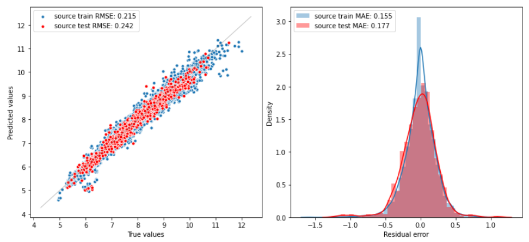
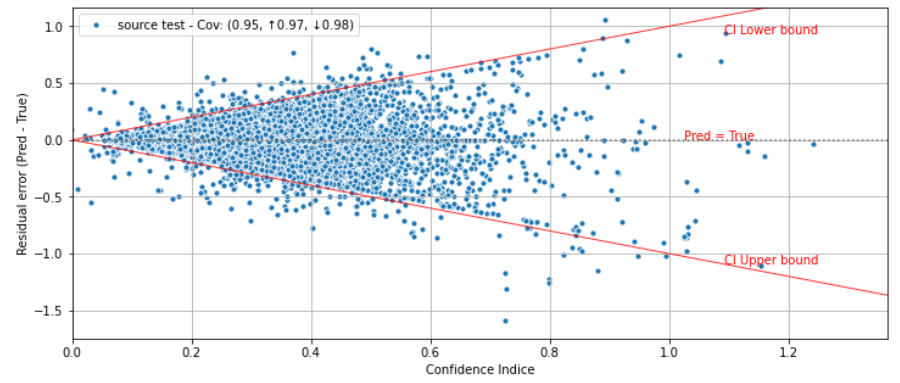
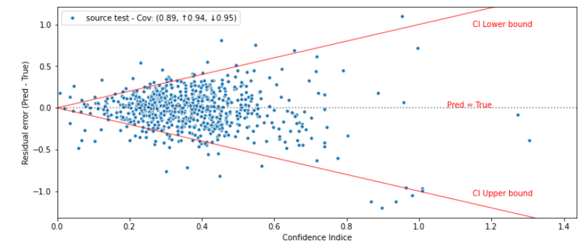

<h2 align='center'> Conformalized Quantile Regression </h2>

## Introduction
CQR is a technique for constructing prediction intervals (PI= that attain valid coverage in finite samples, without making distributional assumptions. It combines the statistical efficiency of **quantile regression** with the distribution-free coverage guarantee of **conformal prediction**.

The advantages of CQR are :

 1. It can wrap around **any algorithm** for quantile regression, including random forests and deep neural networks.
 2. Its rigorous control of the miscoverage rate, **independent** of the underlying regression algorithm.
 3. CQR is a procedure that inherits the advantages of **conformal prediction** and **quantile regression**. 

In CQR method, we use Quantile Regression to estimate the true conditional quantile, and then apply conformal steps on a calibration set to ensure marginal coverage. 
The overall steps are : 
 1. Split the training data into two substets ( proper train & Calibration).

 

 2. Choose any Quantile Regression Model, and fit 2 conditional quantile functions. 
 

 

 

 3. Compute the conformity score.
 

 
 4. Make the prediction for a new test point.
 

 

 

## Results

Let's first look at the prediction performance, and that by looking at the MAE and RMSE while training and testing. 

 

 
In terms of coverage and uncertainty/error correlation we can refer to this graphs, while the first one is in the training data and the second one in the test test. recall that the test set size is 10% of the data thats why we see a small number of points.

 

The interessting phenomenon that we are witnessing here is that there is some points that are aligned with upper and lower bounds, and the dispersion of points are perfectly distributed between the two ligns.

 

## Appendix 

Since this method doesn't not get us the variance, which we need to compute the adopted metrics as the neglog and sharpness. 
To get this values we used the *Extended Pearson-Tukey method* [2]

 

## References 
[1] Romano, Yaniv, Evan Patterson, and Emmanuel Candes. "Conformalized quantile regression." Advances in neural information processing systems 32 (2019).

[2]  By J.J.A. Moors, L.W.G. Strijbosch, W.J.H. van Groenendaal, Estimating mean and variance through quantiles: : an experimental comparison of different methods, July 2002
