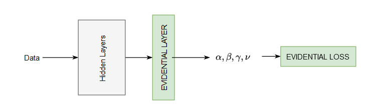
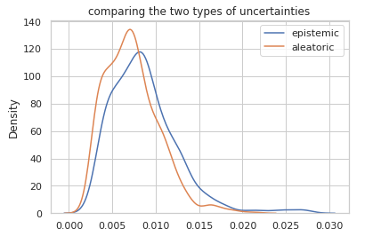
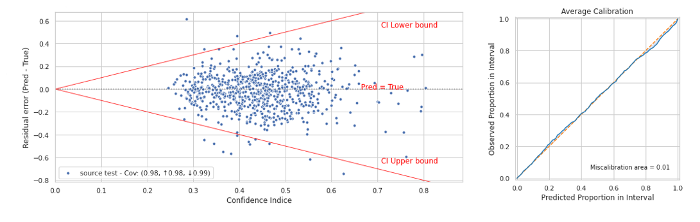

    <h2> Deep Evidential Regression </h2>

## Introduction
Unlike looking to sample from different models, The Evidential approach focuses on getting the high order distribution. 

     

and since we don't know the parameters of this gaussian distribution, we will be estimating it by putting priors on each one them ( the mean and the variance). 

Our model now will learn this new set of parameters .

By learning these parameters we can get the desired estimations by computing the quantities below : 

  

 

## Implementation
One of the advantages of this method is the simplicity to implement it. Firstly, the last output layer should be Evidential, that means the activation function should be conjugate prior which is a Normal Inverse Gamma. Secondly, The loss should be the adopted loss above.

        

## Results

|  |  |
| ------ | ------: |
| Mean Absolute Error (MAE) |**0.122** |
| Root Mean Squarred Error RMSE| **0.162** |
|Calibration Error |  **0.008** |
| Sharpness | **0.151**|
|Negative-Log-Likelihood | **-0.395**|

As mentionned, this method allow us to distinguish between the two uncertainties (aleatoric and epistemic), and here how it looks like if we plot the respective variances.

As we can see, the aleatoric uncertainty is bigger than the epistemic uncertainty, nevethless, both of the estimations are sharp.  

        

Here is the coverage plot and the calibration curve, its done after calibration.

        

---

## References 
[1] Amini, Alexander, et al. "Deep evidential regression." Advances in Neural Information Processing Systems 33 (2020): 14927-14937.

