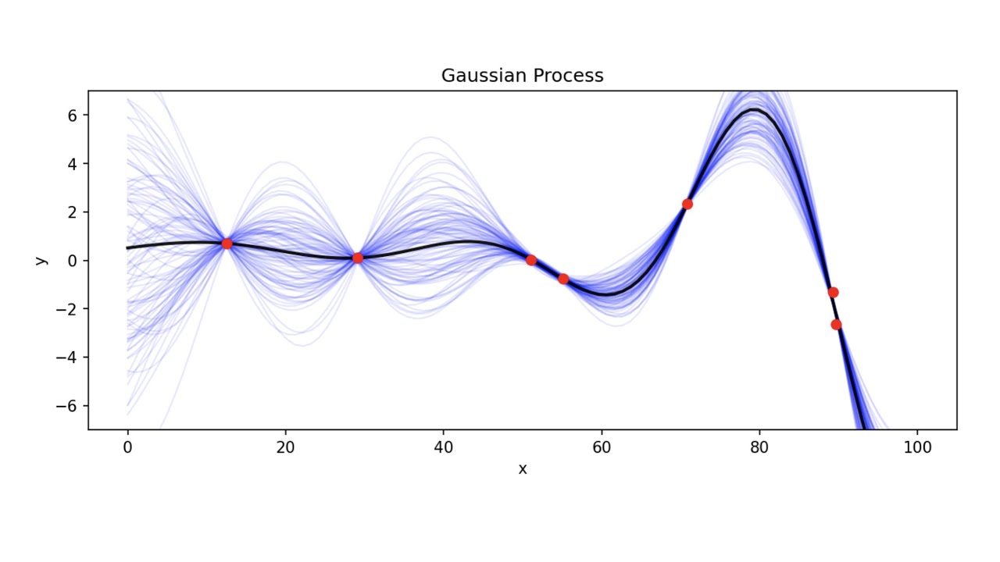
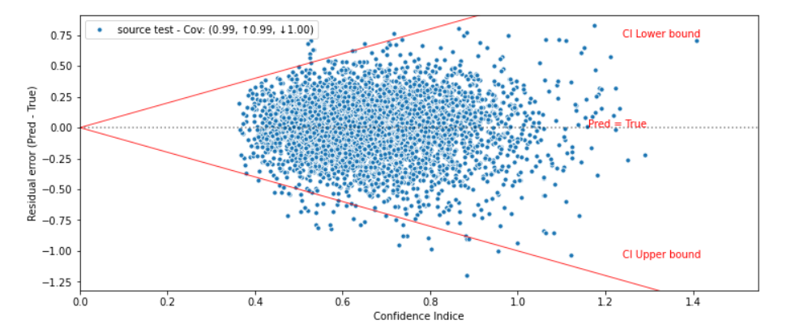

<h2 align='center'> Gaussian Process Regressor </h2>

## Introduction
Gaussian Process Regressor is a non parametric method which means that GPR is not sticj of a functional form, and computing probability distribution over parameters of a specific function, GPR calculates the probability distribution over all admissible functions that fit the data. 

There is several libraries for implementing Gaussian Process Regression `scikit-learn`, `Gpytorch` and `Gpy`
The specifity of GPR is the choice of the prior which is always Gaussian, and thus we write : 

 
Where **m** is the mean and **k** is the covariance matrix.
 

## Results

|  |  |
| ------ | ------: |
|Mean Absolute Error (MAE)| 0.178 |
| Calibration Error |  0.101 |
| Sharpness |  0.161|
|Negative-Log-Likelihood | 0.142|

## References 
[1] Rasmussen, C. E., & Williams, C. K. I., Gaussian processes for machine learning (2016), The MIT Press