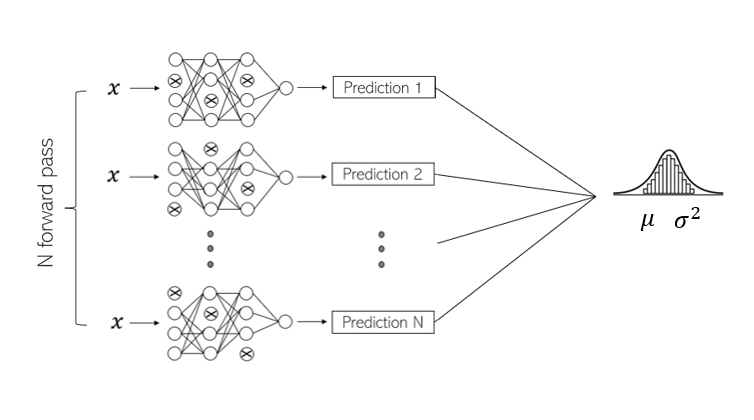
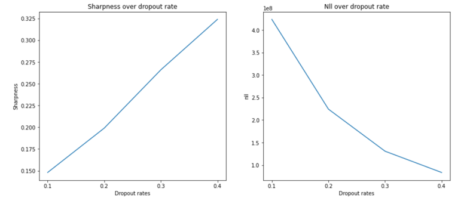
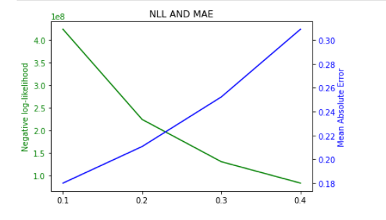
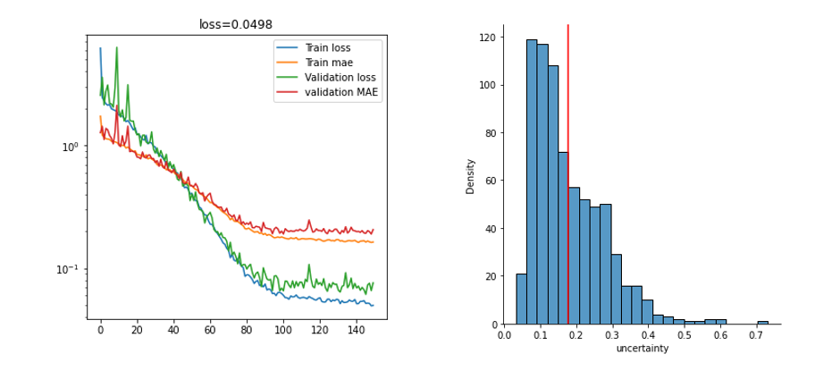
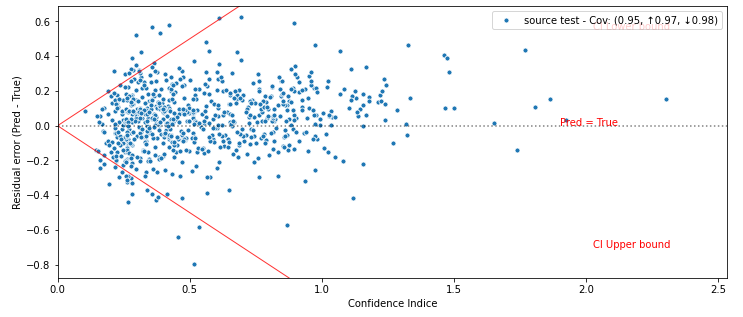

    <h2> Monte Carlo Dropout </h2>

## Presentation
MC Dropout is a Bayesian method for quantifying uncertainties in Machine Learning models, this method gives a mathematical framework to capture the model uncertainty.

The Bayesian frame is always related to the complexity of approximating the posterior distribution, the MCD offers a new way to escape the complexity of the inference when estimating the prior by sampling from multipe models. 

The main idea of the MCD method is to leave the Dropout out operation active during the test, unlike a normal case where the Dropout is activate only in the training and deativate when testing. 
By doing this, we create a variability in the output, and we end up having a distibution rather that one point estimate. 

        

## Analysis

The scoring metrics that we are using here is the nll (negative log-likelihood), sharpness and MAE (mean absolute error). 
In the graph below, we explore the impact of variating the dropout rate over those metrics, for the sharpness we can see that by increasing the dorpout rate the sharpness got bigger, which means we have a bigger uncertainty estimate ( bigger confidence interval). In the opposit, the negative loglikelihood is decreasing when the dropout get bigger.

        

last comparaison is a two y-axis graph where we show the trade-off between having a good MAE score and a good NLL score with the same Dropout rate.

        

## Results
The table below contains the the obtained values of chosen metrics. 

|  |  |
| ------ | ------: |
| Mean Absolute Error (MAE) |**0.197** |
| Root Mean Squarred Error RMSE| **0.261** |
|Calibration Error |  **0.010** |
| Sharpness | **0.213**|
|Negative-Log-Likelihood | **0.468**|

In the graphs below we plot the MAE during training and testing (left), and the estimated uncertainty (right)

        

To sum up, here the confidence graph that outputs 3 standard deviations.

        

## References
[1] Yarin Gal, Zoubin Ghahramani Proceedings of The 33rd International Conference on Machine Learning, PMLR 48:1050-1059, 2016. 