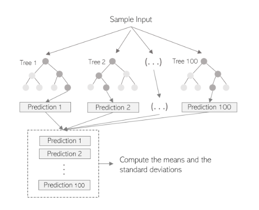
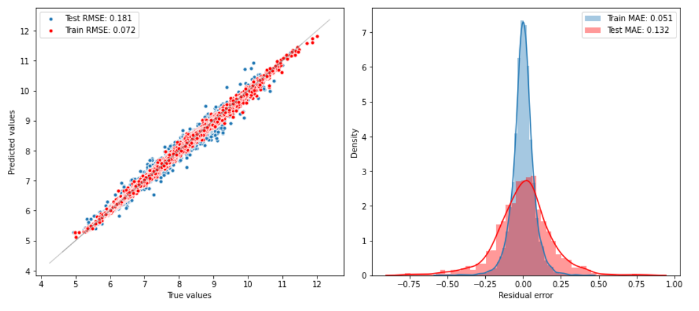
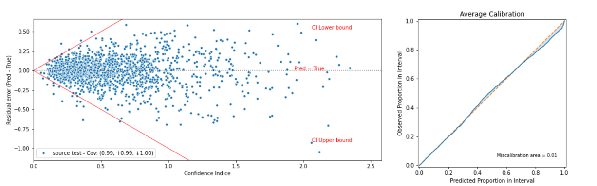

    <h2> Random Forest Regressor </h2>

Refer to the notebook to more implementation details, and to the wiki in this repository to know more about this method.
Here we present very briefly the approach and the results.

The parameters of our Random Forest Regressor are : 
1. Number of estimators : 80
3. Max depth : 26
4. Boostraping : True.

We choose the Mean Average Error `MAE` to evaluate the accuracy of this regression method, we got for the train evalution `MAE_train = 0.051` and for the test `MAE_test = 0.132`.
And the Root Squared Mean Error `RMSE` to evaluate the accuracy of this regression method, `RMSE_train = 0.072` and for the test `RMSE_test = 0.181`

#### Uncertainty Evaluation
Here is the main metrics we use to evaluate the estimated uncertainty `Mean Calibration Error`, `Sharpness` and `Negative log-likelihood`.

|  |  |
| ------ | ------: |
| Calibration Error |  0.011 |
| Sharpness |  0.215|
|Negative-Log-Likelihood | -0.265|

