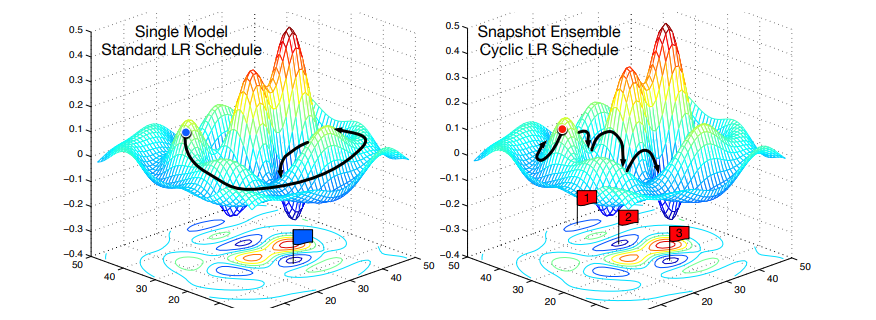
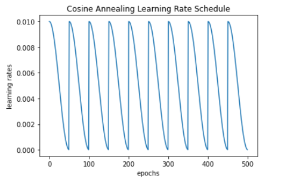
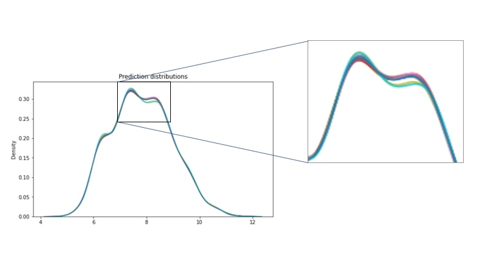
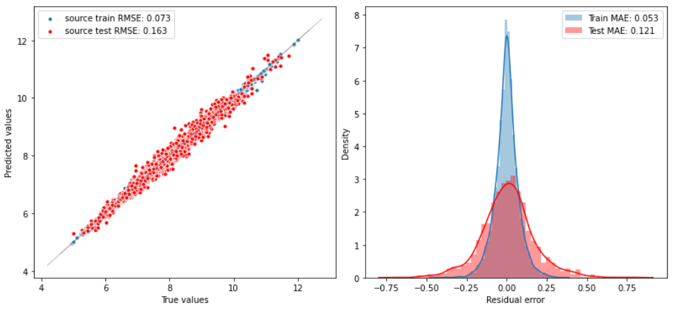
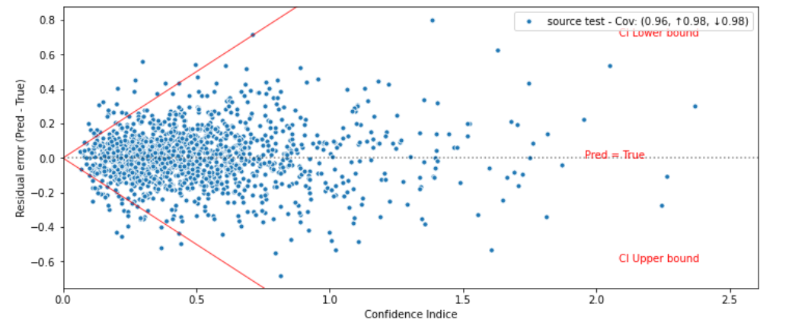

<h2 align='center'> Snapshot Ensemble </h2>


## Introduction
Snapshot Ensemble method is a nice way to counter the big limitation of ensemble methods which is training each model apart which can become rapidly computationaly expensive. This method focuses on controlling the learning rate by defining a schceduler.
The advantages of this techniques is to recover multiple models while training . 

This is achieved by letting a single neural network converge into several local minima along its optimization path and save the model parameters at certain epochs, therefore the weights being saved "snapshots" of the model (picture below)


<div align='center'>
    
</div>

The learning rate scheduler presented in *Huang et al (2017)* is called the **Cosine Annealing** 

<div align='center'>
    
</div>

-  represents the learning rate at epoch .
-  is the total number of epochs.
-  represents the number of cycles (periods).

Since the function is periodicaly decreasing (périodique, décroissante par période) the first value  is equal the maximum learning rate.

To understand how this function works, we plot the cosine Annealing rate scheduler  

<div align='center'>
    
</div>

We notice that the function starts with a maximum lr of 0.01 at the beginning of the cycle and ends the cycle ( 50 epochs ) with a lr close to zero.   

## Implementation
The impletentation relies on **Callbacks** from keras, the callback class allow us to define operations while training, like stop the training when reaching a certain score, save the models when reaching a local minima ... etc. 
```python
from keras.callbacks import Callback
#instanciate the callback
mycallback = Callback()
#add your callback in the model.fit method
model.fit(X_train, y_train,
          validation_data=(X_test, y_test),
          epochs=n_epochs,
          verbose=1, 
          callbacks=[mycallbacks])

```


## Results 

Fllowing the same setup above, where we used a Sequential Neural Network (100,100,100,10,1) and total number of epochs **T=500** divided into 10 cycles **M = 10**.
the variability of predictions with this method is not very disperse as shown in the picture below. 


<div align='center'>
    
</div>

In term of the evalutation of the prediction, we got an `RMSE` and `MAE` not too bad compared to other methods.

<div align='center'>
    
</div>

for the correlation between the residuals and uncertainty :


<div align='center'>
    
</div>


## Comments

We presented in this method an alternative the big limitation of Ensemble methods where training multiple models is is not preferred due to the computational cost of training each single model.


### References
Huang, Gao, et al. "Snapshot ensembles: Train 1, get m for free." arXiv preprint arXiv:1704.00109 (2017).